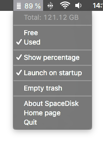

# SpaceDisk

Show disk usage in your menu bar

Screenshots from MacOS and Linux (XFCE)

## Download

**MacOS**

> **[SpaceDisk-1.0.0.dmg](https://github.com/yanbab/spacedisk/releases/download/v1.0.0/SpaceDisk-1.0.0.dmg)** (46.2 MB)

**Source code**

> **[spacedisk-1.0.0.zip](https://github.com/yanbab/spacedisk/archive/v1.0.0.zip)** (94 kB)

## Contribute

**Setup**

    git clone https://github.com/yanbab/spacedisk.git
    cd spacedisk
    npm install

**Commands**

    npm run start  # run app
    npm run dist   # buid app
    npm run build  # build installer

**Todo**

> - [Translations](locales/)
> - Design better [icon theme](themes/default/) and [app icon](build/icon.png)
> - Windows and Linux builds

## License

MIT